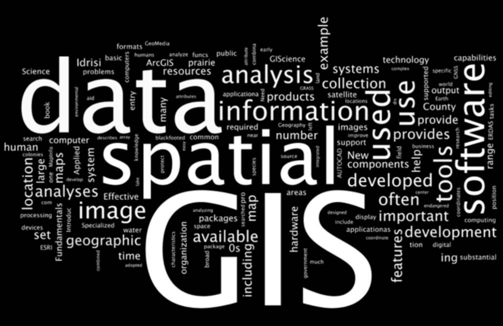
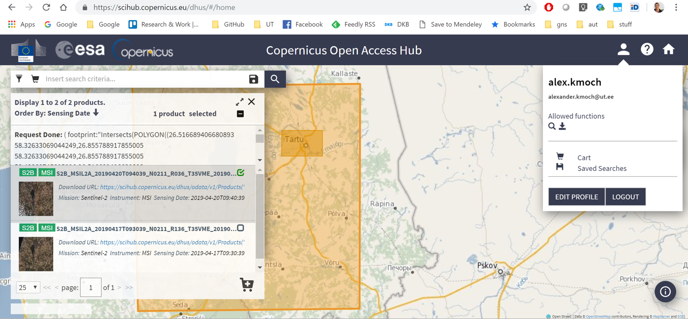
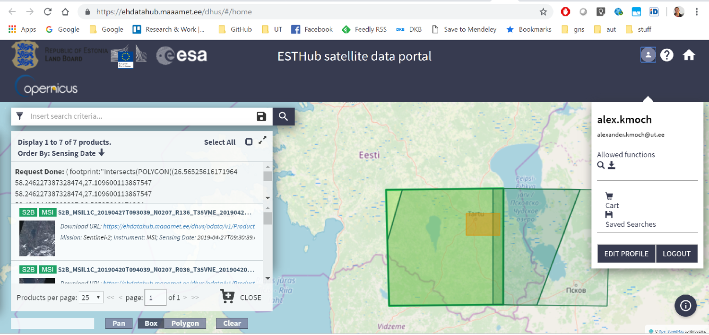
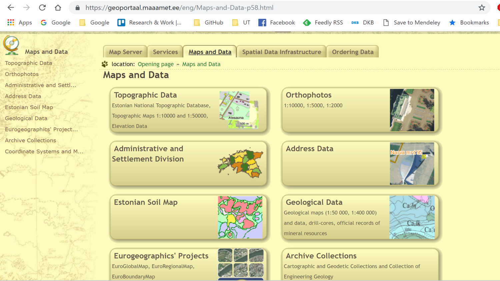
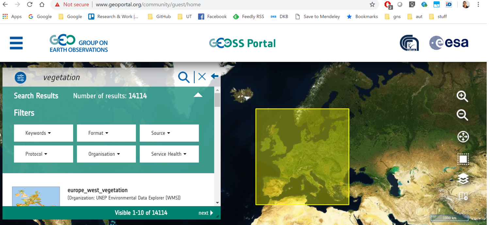
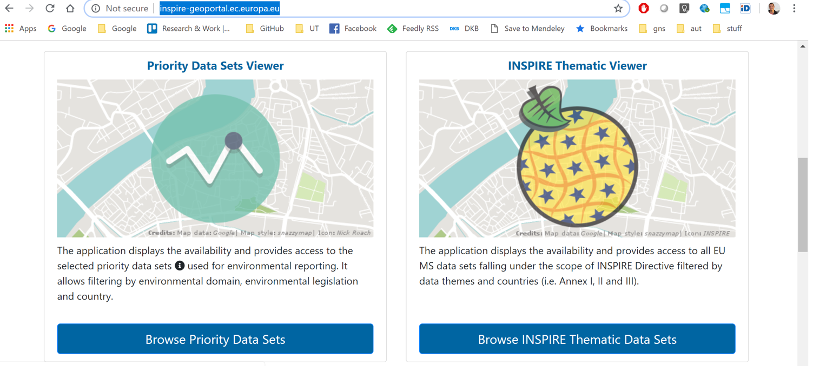
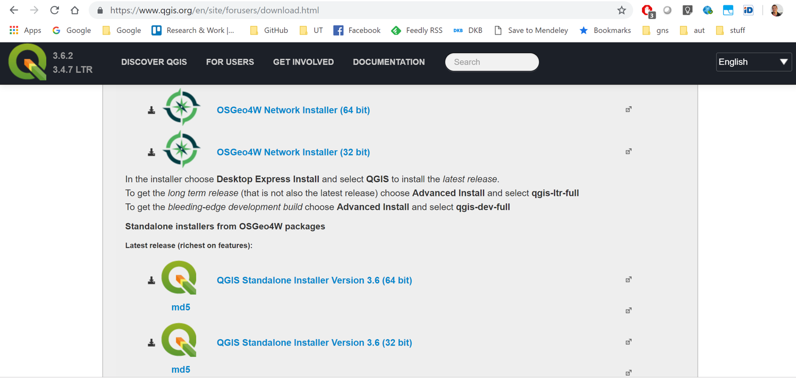
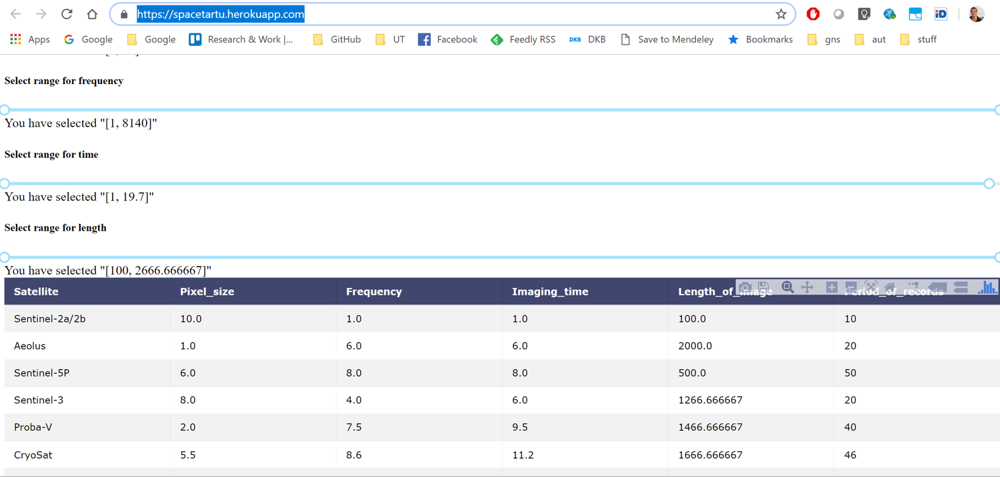
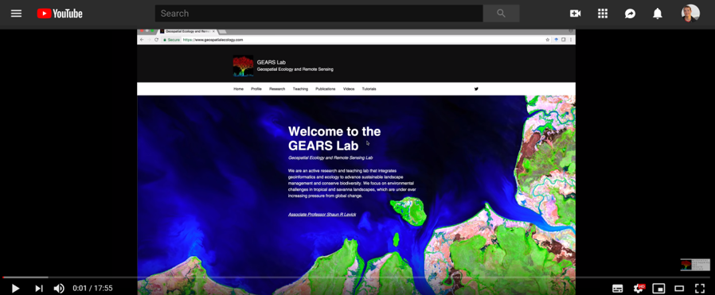

# Where can I get free data about Earth, and what can I do with it?

See the live verison here: https://kodu.ut.ee/~kmoch/SpaceTech_2019_open_geodata/

Alexander Kmoch

- Geoinformatics, Dept. of Geography
- Open Geospatial Consortium technical contact
- University of Tartu, Estonia

SPARK Demo, Tartu, Estonia | 2nd of May 2019

---

##

Where can I get free data about Earth?
(... download all the data)

What can I do with it?
(... and how)?

---

##

---

## Some (spatial data) background

- Geometry (location):

  - Points
  - Lines
  - Polygons
  - = Vector data
  
  - + Properties = Features

- WKT Well Know Text: POINT(58.3, 26.7)
- WKB Well Known Binary

- GeoJSON (web format -> JSON)
- Shapefile (classic, several files!)
- GeoPackage (sqlite with spatial capabitlities)
- KML/KMZ -> Google Earth

---

## Some (spatial data) background

- Geometry (location):

  - Grid with cell size and origin
  - + cell value
  - 1 or more “bands” (like layered grids)
  - = Raster data

- GeoTIFF
- ASCII Grid

---

## Some (spatial data) background

- Satellite Remote Sensing data is Raster data, e.g. in “.dim” format
- Optical and radar

- Bands hold different wave lengths, values are the basically the intensity/amplitude of the reflection of a frequency-range

- Different levels of “readiness” at download, e.g.:
  - Atmospheric correction
  - Cloud-cover
  - Geo-referenced

---

## Some (spatial data) background

Location  needs always be expressed in relation to a reference system

Geographic Coordinate Systems:

- GPS Latitude/Longitude coordinates aka WGS84 aka EPSG:4326 (https://epsg.io/4326)

Projected Coordinate Systems:

- Estonian Coordinate system of 1997 aka EPSG:3301 (https://epsg.io/3301)
- ETRS89 / LAEA Europe aka EPSG:3035 (https://epsg.io/3035)

AXIS ORDER!!!

---

## Open Data for everybody

---

## ESA Sentinel basics

https://scihub.copernicus.eu/ Sentinel-1, Sentinel-2, Sentinel-3 and Sentinel-5P remote sensing products
Login required, just register

http://cci.esa.int/data Ready-made thematic EO data products from ESA Climate Change Initiative
Various viewing options, Dashboard, leads to download options

---

## ESA for Estonia: ESTHUB

https://geoportaal.maaamet.ee/est/Teenused/ESTHub-p629.html (Informative Landing page)

https://ehdatahub.maaamet.ee/dhus/#/home (Sentinel Data for Estonia)

---

## NASA and USGS

https://open.nasa.gov/open-data/

https://earthexplorer.usgs.gov/

---

## Conventional Geodata and Open Data in/for Estonia

Maa-amet / Estonian Land Board

- https://geoportaal.maaamet.ee/est/Andmed-ja-kaardid-p1.html
- https://geoportaal.maaamet.ee/eng/Maps-and-Data-p58.html

Estonian Open Government Data Portal

- https://opendata.riik.ee/en/

---

## Conventional Geodata and Open Data EU/International

The GEOSS portal, Earth Observation data from archives all over the world, implemented & operated by the European Space Agency.

- http://www.geoportal.org/

European INSPIRE Geoportal

- http://inspire-geoportal.ec.europa.eu/

---

##

---

##

---

##

Data Processing

Spatial Context

GIS

---

## ESA SNAP Toolbox

SNAP Toolbox

- http://step.esa.int/main/toolboxes/snap/
- https://sentinels.copernicus.eu/web/sentinel/user-guides

Advanced capabilities for the ESA Climate Change Initiative products

- http://climatetoolbox.io/

---

##

---

## Collaborative Online Processing

https://www.sentinel-hub.com/

For processing online, needs registration and a “project”

https://ehcalvalus.maaamet.ee/calest/calvalus.jsp (Processing, Estonian version of Sentinel HUB)

---

## More Open Source and Open Edu

QGIS, formerly Quantum GIS (https://www.qgis.org)

GDAL (comes also with QGIS installs)

Python libraries: shapely, geopandas, rasterio, gdal, eo-learn

Java: Java Topology Suite (JTS), GeoTools, SNAP toolbox

---

##

---

## More Open Source and Open Edu

Estonian Remote Sensing Resources: https://kaugseire.ee/

Python geospatial introduction, shapely and geopandas: https://kodu.ut.ee/~kmoch/geopython2018/index.html 

R geospatial introduction: http://aasa.ut.ee/Rspatial/

---

##

---

## More Open Source and Open Edu

SpaceApps Tartu 2018 Satify: https://spacetartu.herokuapp.com/

https://gisgeography.com/satellite-list/

https://gisgeography.com/100-earth-remote-sensing-applications-uses/

---

## Introduction to SNAP

https://www.youtube.com/embed/9Y_5Q-932mM

---

## Thank you & See you @SpaceTech!

- Alexander Kmoch
- Geoinformatics, Dept. of Geography
- Open Geospatial Consortium technical contact
- University of Tartu, Estonia

- E:  alexander.Kmoch (at) ut.ee
- T:  https://twitter.com/allixender
- L:  https://www.linkedin.com/in/allixender/

## Appendix: GIS and Remote Sensing web blog resources

- https://gisgeography.com/satellite-list/
- https://gisgeography.com/category/remote-sensing/page/3/
- https://gisgeography.com/100-earth-remote-sensing-applications-uses/

- https://2018.spaceappschallenge.org/challenges/what-world-needs-now/globe-observer/teams/satify/stream

---

## Appendix: ESA Open Data links

- Sentinel Hub
- SNAP

- http://climatetoolbox.io/
- http://step.esa.int/main/toolboxes/snap/

- http://www.geoportal.org/

- http://open.esa.int/

- https://earth.esa.int/

- https://earth.esa.int/web/guest/data-access/how-to-access-esa-data
- https://sentinels.copernicus.eu/web/sentinel/user-guides
- https://earth.esa.int/web/guest/data-access/browse-data-products
- https://earth.esa.int/web/guest/missions/esa-operational-eo-missions/smos/multimedia-book

---

## Appendix: Machine learning and software tutorials:

- sentinel-hub/eo-learn python library https://github.com/sentinel-hub/eo-learn
- and a nice article related to it: https://medium.com/sentinel-hub/land-cover-classification-with-eo-learn-part-1-2471e8098195

- https://rastervision.io/

- or a deeplearning Sea Temperature Convolutional LSTM example https://deeplearning4j.org/tutorials/15-sea-temperature-convolutional-lstm-example

---

## Appendix: Further links and resources for GIS and Geospatial Big data

- http://www.rasdaman.org
- https://www.opendatacube.org/

- https://earthengine.google.com/
- https://earthexplorer.usgs.gov
- https://landsatlook.usgs.gov
- https://glovis.usgs.gov

- https://cloud.google.com/storage/docs/public-data-sets/landsat
- https://aws.amazon.com/public-data-sets/landsat

- https://landsat.gsfc.nasa.gov/the-worldwide-reference-system/
- https://landsat.usgs.gov/landsat-global-archive-consolidation-lgac
- http://rsgislib.org/arcsi/
